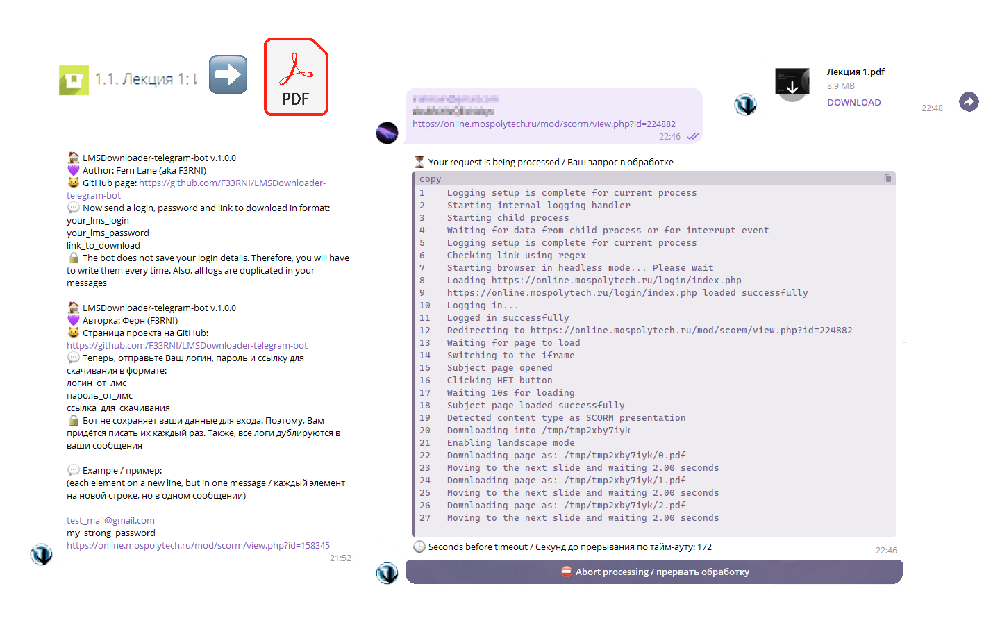

# 🏠 LMSDownloader-telegram-bot
### Telegram bot for downloading presentations and lectures from LMS using headless Chrome
<div style="width:100%;text-align:center;">
   <p align="center">
      
   </p>
</div>
<div style="width:100%;text-align:center;">
   <p align="center">
      <a href="https://www.youtube.com/@F3RNI"></a>
      <a href="https://f3rni.bandcamp.com"></a>
      <a href="https://open.spotify.com/artist/22PQ62alehywlYiksbtzsm"></a>
      <a href="https://soundcloud.com/f3rni"></a>
   </p>
</div>



----------

## 📙 Dependencies

- **LMSDownloader**: https://github.com/F33RNI/LMSDownloade
- **python-telegram-bot**: https://github.com/python-telegram-bot/python-telegram-bot

----------

## ❓ Get started

1. Install Python and pip
2. Download source code
3. Create virtual environment `python -m venv venv` and activate it
4. Install requirements `pip install -r requirements.txt --upgrade`
5. Carefully change all the settings (in the `config.json` file) to suit your needs. If you have questions regarding any setting, open an issue, I will add a more detailed description
6. Create bot at https://t.me/BotFather
7. Type Bot's token into `bot_api_token` in `config.json` file
8. Run main script `python main.py`

----------

## 💬 Bot messages

- You can edit telegram bot messages by editing file `messages.json`. You can add new lines by adding `\\n`

**Note:** make sure you don't delete argumensts `{}`, `{0}`, `{1}`, ... in message and please restart python script to apply changes

#### /start

```
🏠 LMSDownloader-telegram-bot v.1.0.0
💜 Author: Fern Lane (aka F3RNI)
😺 GitHub page: https://github.com/F33RNI/LMSDownloader-telegram-bot
💬 Now send a login, password and link to download in format:
your_lms_login
your_lms_password
link_to_download
🔒 The bot does not save your login details. Therefore, you will have to write them every time. Also, all logs are duplicated in your messages

🏠 LMSDownloader-telegram-bot v.1.0.0
💜 Разработка: Ферн Лейн (F3RNI)
😺 Страница проекта на GitHub: https://github.com/F33RNI/LMSDownloader-telegram-bot
💬 Теперь, отправьте Ваш логин, пароль и ссылку для скачивания в формате:
логин_от_лмс
пароль_от_лмс
ссылка_для_скачивания
🔒 Бот не сохраняет ваши данные для входа. Поэтому, Вам придётся писать их каждый раз. Также, все логи дублируются в ваши сообщения

💬 Example / пример: 
(each element on a new line, but in one message / каждый элемент на новой строке, но в одном сообщении)

test_mail@gmail.com
my_strong_password
https://online.mospolytech.ru/mod/scorm/view.php?id=158345
```

----------

## 🐧 Running as service on linux

1. Install Python and pip
2. Clone repo
   1. `git clone https://github.com/F33RNI/LMSDownloader-telegram-bot/`
   2. `cd LMSDownloader-telegram-bot`
3. Edit `config.json`
4. Install systemd
   1. `sudo apt-get install -y systemd`
5. Create new service file
   1. `sudo nano /etc/systemd/system/lmsdownloader.service`
      ```
      [Unit]
      Description=LMSDownloader-telegram-bot service
      After=multi-user.target
      
      [Service]
      Type=simple
      Restart=on-abort
      WorkingDirectory=/PATH_TO/lmsdownloader
      ExecStart=/PATH_TO/lmsdownloader/venv/bin/python main.py
      RestartSec=5
      
      [Install]
      WantedBy=multi-user.target
      ```
6. Reload systemctl daemon
   1. `sudo systemctl daemon-reload`
7. Enable and start service
   1. `sudo systemctl enable lmsdownloader`
   2. `sudo systemctl start lmsdownloader`

----------

## 📜 Data collecting

The bot does not save **and doesn't log** users **and login / password** details

----------

## ✨ Contribution

- Anyone can contribute! Just create a pull request

----------

### 🚧 P.S. This project is under development!

- If you find a real bug, please create an Issue
